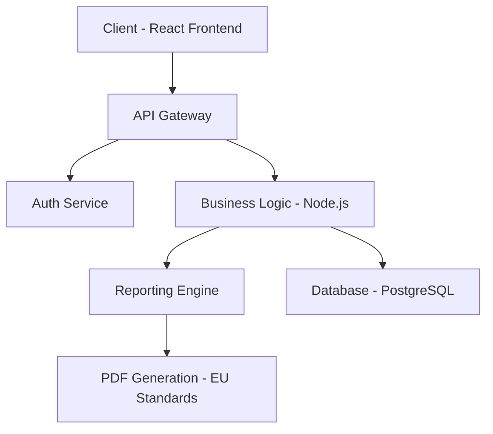

# Kleer Infini - B2B Business Platform

  

**Kleer Infini** est une plateforme B2B haut de gamme concue pour repondre aux normes institutionnelles europeennes. Elle permet une gestion fluide des processus commerciaux avec une esthetique raffinee et professionnelle.

---

## Architecture & Design

## Fonctionnalites Cles
- **Interface Institutionnelle** : Design epure base sur des themes blanc/beige pour une image corporate forte.
- - **Gestion de Workflow** : Systeme de guidage par etapes pour les processus complexes.
  - - **Reporting Avance** : Generation de rapports techniques de plus de 20 pages conformes aux standards europeens.
    - - **Scalabilite Internationale** : Architecture concue pour le deploiement multi-marches.
     
      - ## Stack Technique
      - - **Frontend** : React.js, JavaScript, CSS (Vanilla/Custom).
        - - **Architecture** : Modulaire et orientee composants pour une maintenance facile.
          - - **Design** : Focus sur l'UI/UX avec typographi
